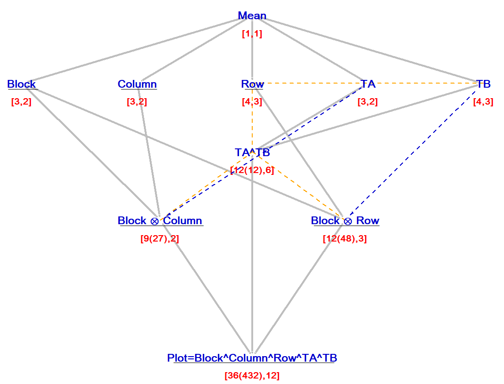

## Introduction

In many areas of scientific research complex experimental designs are now routinely employed. Failing to correctly identify the structure of the experimental design can lead to incorrect model selection and misleading inferences. @bate2016a describe an eight-stage procedure that focuses attention on the relationship between the experimental material and the experimental design. Stages 1 to 5 of the procedure begin by identifying the underlying structure of the selected design, which generates a list of ‘*Structural objects*’ consisting of factors and generalised factors (that correspond to combinations of the levels of the factors). This list is summarised through the so-called ‘*Layout Structure*’ and highlights any potential weaknesses it may have. In Stages 6 to 7, the procedure uses the structure of the design (as summarised by the Layout Structure) in conjunction with the randomisation performed to define a set of ‘*randomisation objects*’ (which form the ‘*Restricted Layout Structure*’), see @bate2016b. The randomisation objects in the Restricted Layout Structure can then be used in Stage 8 to define the model terms that are included in a mixed model for the statistical analysis.

The Layout and Restricted Layout structures can be visualised using a generalisation of the Hasse Diagram. These diagrams can be generated using the `hassediagrams` package in `R`.


## Understanding the Structure of the Experimental Design

@bate2016a describe a five-stage process to identify the structure of the experimental design. These stages are summarised in Table 1.

Table 1: Overview of the proposed five-stage process to identify the Layout Structure (Bate and Chatfield, 2016a).
```{r five_stage_process, echo=FALSE}
library(kableExtra)
library(knitr)

# Create the table
data <- data.frame(
  Stage = c("1", "2", "3", "4", "", "5"),
  Outcome = c(
    "A list of factors", "Factor levels", "Experiment Scheme", 
    "Layout Structure", "Hasse diagram of the Layout Structure", "Degrees of freedom"
  ),
  Purpose = c(
    "Researcher should aim to identify the factors that are a) ‘of interest’ and/or b) inherent to the experimental material or c) additional potential sources of variability.",
    "To define the factor levels – this is required so that the structure of the experimental design can be identified algorithmically.",
    "The researcher defines the properties the experimental design should have, identify the class of design they wish to use and potentially the non-randomised experimental design itself.",
    "To summarise the relationships between the factors in the experimental design to help identify the structure of the experimental design.",
    "To visualise the structure of the experimental design.",
    "To identify potential weaknesses in the design (i.e. lack of replication) and degrees of freedom in a statistical analysis using a model based on the factors/generalised factors in the Layout Structure."
  ),
  Properties = c(
    "The list must contain all factors the researcher wishes to include in the experimental design.",
    "For each factor, the factor levels should be specified uniquely.",
    "A list of the factors and factor levels that define the design, a list of the properties the design should have which should respect the relationships between inherent factors, the choice of design class and, if possible, the non-randomised design.",
    "A list of factors and generalised factors and the relationships between the factors.",
    "A diagram illustrating the crossed/nested/equivalent relationships between the factors/generalised factors in the design.",
    "For each factor/generalised factor the number of levels of the factor, the number of levels present in the design and the associated degrees of freedom."
  ),
  Derived_from = c(
    "Hypotheses to be tested and background knowledge of the experimental material.",
    "Background knowledge of the practicalities of the experiment and how the experiment will be managed.",
    "The factors, factor levels and background knowledge of the experimental material.",
    "Factors, factor levels, nested/crossed/equivalent relationships between the factors as defined in the Experiment Scheme and the experimental design plan (generated using the Experimental Factors table and Layout Structure table).",
    "Layout Structure.",
    "Factor levels, experimental design and Hasse diagram."
  )
)

# Render the table
knitr::kable(
  data,
  format = "html",
  booktabs = TRUE,
  escape = FALSE,
  col.names = c(
    "Stage",
    "Outcome",
    "Purpose of stage",
    "Properties of the outcomes from the stage",
    "What the stage outcomes are derived from"
  )
) %>%
kable_styling(full_width = TRUE, bootstrap_options = c("striped", "hover", "condensed", "responsive")) %>%
    row_spec(0, bold = TRUE) %>%  # Make header bold
    kable_classic(full_width = TRUE, html_font = "Arial") %>%  # Classic table style
    column_spec(1:5, border_left = TRUE, border_right = TRUE) %>% # Add borders
    row_spec(0, extra_css = "border: 1px solid black;") %>%  # Ensure full borders
    row_spec(0:nrow(data), extra_css = "border: 1px solid black;")  # Add horizontal borders
```


### **Stage 1. Identifying the experimental factors**

The process begins by identifying all of the effects (and hence corresponding factors) that may influence the outcome of the response variable or are needed to define the structure of the experimental material. The scientist should consider the following:

**S1(a)** All ‘factors of interest’ which include, but are not limited to, 'treatment' factors.

**S1(b)** All factors that either define the physical structure of the experimental material or are inherent to the conduct of the proposed experiment, (the inherent factors) not already considered in S1(a).

**S1(c)** Factors that identify likely experimental units, if not already defined in S1(a) and S1(b). At this stage it is useful for the scientist to consider which factors they plan to assign to experimental units ('treatment' factors) and what experimental units they are to be assigned to. Factors should be included that uniquely index any likely experimental units.

**S1(d)** The factor that identifies the observational units, if not already defined in S1(a-c).

**S1(e)** Any additional effects that are likely sources of variability in the experiment and, unless choosing to control them at a specific level, ensure that there are factors included in the process to account for them (for example, additional blocking factors or effects of time that have not been considered inherent in S1(b)).

Once the set of factors has been generated, it may be decided to ignore some of the inherent factors when constructing the design as they do not correspond to potential sources of variability (the *ignored inherent* factors). Care should be taken when doing this however, inherent factors should be retained in the process if the scientist cannot rule them out as potential sources of variability. Even if it is intended to ignore an inherent factor in the design, that factor should be retained in the process at this stage as a prompt to the researcher that the design will be 'non-conforming' in stage 3.


### **Stage 2. Specifying the factor levels**

At this stage the researcher should make an initial assessment of the factor level labels using the following process:

**S2(a)** The factor level labels must be uniquely specified and have a practical meaning within the experiment.

**S2(b)** Following an assessment of the design it may be the case that the factor levels change, for example if the experimental design is amended to more efficiently account for nuisance sources of variability.

So, for example, if there are twenty subjects in an experiment, ten per treatment arm (say treatment or control), then the subjects should be labelled 1 to 20 and not 1 to 10 for the treatment group, 1 to 10 for the control group.

### **Stage 3. Choosing the Experiment Scheme**

Once the factors and levels have been identified in stages 1 and 2, the *Experiment Scheme* describes the planning stages of the experiment and the decisions taken before randomising the experimental material. It consists of:

**S3(a)** A list of the factors and factor levels, as described in stages 1 and 2.

**S3(b)** A list of all the properties that the experimental design should have (for example, a decision to equally replicate the treatments or a decision that all the treatments should be administered within each block).

**S3(c)** The type of design required (for example, block, split-plot, cross-over, etc.).

**S3(d)** The non-randomised design itself, which specifies the non-randomised allocation of treatments to the experimental units, i.e. a list of the combinations of the levels of the factors present in the design for each observational unit. If the non-randomised design is unavailable, then the randomised allocation can be used instead.


### **Stage 4. Identifying the structure of the experimental design and constructing the Layout Structure**

Once the factors have been identified, the factor levels chosen and the Experiment Scheme devised, the *Layout Structure* can be constructed. The Layout Structure consists of:

**S4(a)** A list of 'structural' objects consisting of the factors that define the experimental design (identified in stage 1).

**S4(b)** The generalised factors (that correspond to combinations of the factors) that are implied by the structure of the experimental design.

**S4(c)** A description of the nested, crossed and equivalent relationships between the factors, as exhibited in the experimental design.

An algorithmic approach that can be used to generate the Layout Structure is described in Bate and Chatfield (2016a). The Layout Structure can be visualised using a generalisation of the Hasse Diagram and the `hassediagrams` package can be used to generate the diagram in `R`, see below.

### **Stage 5. Assigning the levels and degrees of freedom**

The levels and degrees of freedom can now be determined for the factors and generalised factors present in the Layout Structure.

**S5(a)** For each generalised factor present in the Layout Structure we begin by calculating the total number of combinations of the levels of the factors that are present in the design.

**S5(b)** We also calculate the total number of potential levels. This is the theoretical number of levels rather than the number of observed levels. If a factor is nested within another factor, then the number of potential levels for this factor is taken as the number of levels that the nested factor has (and not the number of potential levels of the nested factor crossed with the factor which nests it, as usually this will be practically meaningless).

**S5(c)** For equivalent factors/generalised factors with different numbers of potential levels, it is the highest number that is used as the number of potential levels.

**S5(d)** To calculate the degrees of freedom for the factor/generalised factor \(G_{u}\), all degrees of freedom from the factors and generalised factors that nest \(G_{u}\) in the Layout Structure are subtracted from the number of levels of \(G_{u}\) present in the design. This is similar to the approach outlined by @tjur1984 and is defined as the subtraction approach.


### **Example: Split-plot split-block experiment**

@federer1975, Example 6.1, describes a *split-plot split-block experiment* consisting of two treatment factors, TA (levels: \( a_0, a_1 \) and \( a_2 \)) and TB (levels: \( b_0, b_1, b_2 \) and \( b_3 \)). The experiment was broken down into three blocks, where each block consists of a \( 4 \times 3 \) grid of plots. The rows and columns that define the individual plots within blocks are labelled across blocks. This implies the researcher believes there are systematic effects across the rows and columns of the plots within the blocks. So the Row factor is defined as a factor with four levels and the Column factor with three levels. In the Experiment Scheme it is decided to use a Latin square to allocate the levels of treatment TA to the columns of the design and a Youden rectangle to allocate the levels of treatment TB to the rows of the design. The experiment scheme is given in Table 2, and the Hasse diagram of the Layout Structure for this design is given in Figure 1. Note there are some warning messages indicating shared degrees of freedom not included.

Table 2: The experiment scheme for the split-plot split-block experiment including TA, TB, Block, Row and Column levels.
```{r splitplot_table, echo=FALSE}
library(kableExtra)
library(knitr)

# Define the table structure with correct math notation
table_data <- data.frame(
  Block = c("**Block I**", "", "$r_1$", "$r_2$", "$r_3$", "$r_4$", "", 
            "**Block II**", "", "$r_1$", "$r_2$", "$r_3$", "$r_4$", "", 
            "**Block III**", "", "$r_1$", "$r_2$", "$r_3$", "$r_4$"),
  c1 = c("", "$c_1$", "$a_0, b_0$", "$a_0, b_1$", "$a_0, b_2$", "$a_0, b_3$", "", 
         "", "$c_1$", "$a_1, b_3$", "$a_1, b_0$", "$a_1, b_1$", "$a_1, b_2$", "", 
         "", "$c_1$", "$a_2, b_2$", "$a_2, b_3$", "$a_2, b_0$", "$a_2, b_1$"),
  c2 = c("", "$c_2$", "$a_1, b_0$", "$a_1, b_1$", "$a_1, b_2$", "$a_1, b_3$", "", 
         "", "$c_2$", "$a_2, b_3$", "$a_2, b_0$", "$a_2, b_1$", "$a_2, b_2$", "", 
         "", "$c_2$", "$a_0, b_2$", "$a_0, b_3$", "$a_0, b_0$", "$a_0, b_1$"),
  c3 = c("", "$c_3$", "$a_2, b_0$", "$a_2, b_1$", "$a_2, b_2$", "$a_2, b_3$", "", 
         "", "$c_3$", "$a_0, b_3$", "$a_0, b_0$", "$a_0, b_1$", "$a_0, b_2$", "", 
         "", "$c_3$", "$a_1, b_2$", "$a_1, b_3$", "$a_1, b_0$", "$a_1, b_1$"),
  stringsAsFactors = FALSE
)

knitr::kable(table_data, format = "html", escape = FALSE, col.names = NULL) %>%
  kable_styling(full_width = FALSE, position = "center") %>%
  row_spec(which(table_data$Block %in% c("**Block I**", "**Block II**", "**Block III**")), 
           bold = TRUE, extra_css = "text-align: center; border: 1px solid black;") %>%
  column_spec(1:4, border_left = TRUE, border_right = TRUE) %>%  # Remove align argument
  row_spec(1:nrow(table_data), extra_css = "border: 1px solid black; text-align: center;")
```

```{r hasse_diagram_ls, echo=FALSE, out.width='80%', fig.align='center', fig.cap="Hasse diagram of the Restricted Layout Structure for the Split-Plot Split-Block Experiment."}

```


## Using the structure of the experimental design and the randomisation to construct a mixed model

Once the first 5 stages have been performed, and the Layout Structure generated and the Hasse Diagram of the Layout Structure produced, the researcher can then move onto the randomisation and identify a suggested mixed model. These final three stages are summarised in Table 3 (see Bate and Chatfield, 2016b).

Table 3: Overview of the proposed three-stage process to identify the Restricted Layout Structure.
```{r restricted_layout_table, echo=FALSE}
library(kableExtra)
library(knitr)

# Define table data
table_data <- data.frame(
  Stage = c("6", "", "7", "", "", "8"),
  Components = c(
    "Randomisation", "Description of the randomisation", 
    "Categorisation of factors as fixed or random", "Restricted Layout Structure", 
    "Hasse diagram of the Restricted Layout Structure", "The mixed model formation"
  ),
  Purpose = c(
    "Randomise the experimental material.", 
    "Defining the randomisation in terms of randomisation objects to aid in model selection.",
    "To aid in the analysis and also model selection.",
    "To construct a list of the randomisation objects (those involved in the randomisation and the randomisation objects that nest them) to aid in model development.",
    "To visualise the structure of the experiment as implied by the randomisation performed.",
    "Identify the terms to include in the mixed model."
  ),
  Properties = c(
    "A randomised plan of the experimental design.",
    "A list of randomisation objects that define the randomisation performed with randomisation arrows connecting them (randomisation objects 'involved in the randomisation').",
    "A list of random factors and a list of fixed factors.",
    "A list of randomisation objects.",
    "A diagram illustrating the crossed and nested relationship between the randomisation objects.",
    "A list of model terms."
  ),
  Derived_From = c(
    "The randomisation performed and the un-randomised experimental design.",
    "Knowledge of the randomisation performed.",
    "Knowledge of the properties of the factors, the hypotheses being tested and the nesting of factors in the design.",
    "The Layout Structure and the randomisation object pairs that are connected by randomisation arrows.",
    "Layout Structure and the Restricted Layout Structure.",
    "The objects in the Restricted Layout Structure."
  ),
  stringsAsFactors = FALSE
)

# Render the table
knitr::kable(
  table_data, format = "html", escape = FALSE, 
  col.names = c("Stage", "Components produced", "Purpose of component", "Properties of the component", "What the component is derived from")
) %>%
  kable_styling(full_width = TRUE, bootstrap_options = c("striped", "hover", "condensed", "responsive")) %>%
    row_spec(0, bold = TRUE) %>%  # Make header bold
    kable_classic(full_width = TRUE, html_font = "Arial") %>%  # Classic table style
    column_spec(1:5, border_left = TRUE, border_right = TRUE) %>% # Add borders
    row_spec(0, extra_css = "border: 1px solid black;") %>%  # Ensure full borders
    row_spec(0:nrow(data), extra_css = "border: 1px solid black;")  # Add horizontal borders
```


### **Stage 6a. Performing the randomisation**

Once the Experiment Scheme has been developed and the experimental design selected, the researcher can perform the randomisation through the randomisation of the levels of one factor/generalised factor to another. In this paper, a randomisation is defined as either *conforming or non-conforming*.

A randomisation is defined as *conforming* if it respects the relationships between the factors involved in the randomisation, as defined in the Layout Structure and Experiment Scheme. So, for example, if the scientist decides to use a balanced incomplete block design (BIBD) as the experimental design, then a conforming randomisation would involve: (i) randomly selecting a BIBD from a suitable set of designs, (ii) randomising the treatments to the treatment labels of the un-randomised design, and (iii) randomising the treatments to plots separately within each block. The randomisation reflects the block design and respects the Experiment Scheme. It is therefore a conforming randomisation. Conforming randomisations are recommended as they reflect the choices made when developing the Experiment Scheme.

A randomisation is defined as *non-conforming* if it does not respect the relationships between the factors involved in the randomisation, as defined by the Layout Structure and Experiment Scheme. So, for example, if the scientist decides to use a balanced incomplete block design (BIBD) as the experimental design but then randomises the treatments to the plots ignoring the blocks, then this is a non-conforming randomisation as the randomisation does not reflect the block design as chosen in the Experiment Scheme. As a non-conforming randomisation does not respect the relationships between the factors in the Experiment Scheme, it may affect how they are assessed in the statistical analysis and have implications on the suitability of the experiment to generate estimates of the effects. This may be unintended by the scientist, and hence such randomisations are not generally recommended.  


### **Stage 6b. Describing the randomisation**

In order to construct a randomisation-based statistical model, the randomisation is defined using an arrow notation and associated randomisation objects. This approach is an adaptation of the method described in Bate and Chatfield (2016b). The terminology *randomisation objects* is used to differentiate them from the *structural objects* (the factors/generalised factors) that describe the structural relationships between the factors as defined by the experimental design.

Consider a randomisation that involves two factors/generalised factors \( F_{u} \) and \( F_{v} \), where the levels of \( F_{u} \) are randomly assigned to the levels of \( F_{v} \) (\( F_{u} \) is randomised to \( F_{v} \) for short):  

- If the levels of \( F_u \) are randomised to the levels of \( F_v \), and no other factor/generalised factor is involved in the randomisation, then write:  
  \[
  F_u \rightarrow F_v. \tag{1}
  \]

- If the levels of \( F_u \) are randomised to the levels of \( F_v \) separately within each level of a third factor/generalised factor \( F_w \), then write:  
  \[
  F_u \rightarrow F_v[F_w]. \tag{2}
  \]

- If the levels of \( F_u \) are randomised to the levels of the generalised factor \( F_v \wedge F_w \) by independently randomising the levels of \( F_v \) and \( F_w \), then write:  
  \[
  F_u \rightarrow F_v \otimes F_w, \tag{3}
  \]
  where the \( \otimes \) symbol denotes that the levels of factors \( F_v \) and \( F_w \) have been permuted separately.

- If the levels of the generalised factor \( F_u \wedge F_v \) are randomised to the levels of the factor \( F_w \) by independently randomising the levels of \( F_u \wedge F_v \), then write:  
  \[
  F_u \wedge F_v \rightarrow F_w. \tag{4}
  \]

- If the levels of the generalised factor \( F_u \wedge F_v \) are randomised to the levels of the factor \( F_w \) by randomising the levels of \( F_u \) independently to the randomisation of the levels of \( F_v \), then write:  
  \[
  F_u \otimes F_v \rightarrow F_w. \tag{5}
  \]

Randomisation objects at the beginning and end of the randomisation arrows are said to be *involved in the randomisation*. Each randomisation object (factor or generalised factor) has a corresponding structural object; these are formally defined in Table 4. The levels of the randomisation objects are equivalent to the levels of the corresponding factors/generalised factors. Note the relationship between the structural object \( F_v \wedge F_w \) (in the Layout Structure) and the randomisation objects \( F_v \wedge F_w \) and \( F_v \otimes F_w \) (at either end of a randomisation arrow). The levels of both objects correspond to the combinations of \( F_v \) and \( F_w \).

Table 4: Randomisation objects and corresponding structural objects that share the same levels.
```{r randomisation_objects_table, echo=FALSE}
library(kableExtra)
library(knitr)

# Define table data
table_data <- data.frame(
  Randomisation_Object = c(
    "$F_v$", 
    "$F_v \\wedge F_w$", 
    "$F_v [F_w]$", 
    "$F_v \\otimes F_w$", 
    "$\\{ F_v \\otimes F_w \\} [F_x]$", 
    "$F_v \\otimes \\{ F_w [F_x] \\}$", 
    "$F_v [F_w \\otimes F_x]$", 
    "$F_x \\otimes F_v \\otimes F_w$"
  ),
  Structural_Object = c(
    "$F_v$", 
    "$F_v \\wedge F_w$", 
    "$F_v (F_w)$", 
    "$F_v \\wedge F_w$", 
    "$F_v \\wedge F_w (F_x)$", 
    "$F_v \\wedge F_w (F_x)$", 
    "$F_v (F_w \\wedge F_x)$", 
    "$F_x \\wedge F_v \\wedge F_w$"
  ),
  stringsAsFactors = FALSE
)

# Render the table
knitr::kable(
  table_data, format = "html", escape = FALSE,
  col.names = c("Randomisation object", "Corresponding structural object"),
) %>%
  kable_styling(full_width = FALSE, position = "center", bootstrap_options = c("striped", "hover", "condensed", "responsive")) %>%
  column_spec(1:2, border_left = TRUE, border_right = TRUE, width = "50%") %>%  # Removed `align`
  row_spec(0, bold = TRUE, background = "#f2f2f2", extra_css = "border: 1px solid black; text-align: center;") %>% # Header styling
  row_spec(1:nrow(table_data), extra_css = "border: 1px solid black; text-align: center;") # Row styling
```


As commented by @brien2006, randomisation arrows can be aligned in either direction. In the proposed approach, if the two randomisation objects at either end of an arrow have different numbers of levels, then the arrow begins at the randomisation object that corresponds to the structural object with fewer levels. If the randomisation objects at either end of an arrow correspond to equivalent structural objects, then the arrow can point in either direction.

As with structural objects, it is possible to define a nesting hierarchy for randomisation objects. This nesting hierarchy will be used to identify randomisation objects to be included in the Restricted Layout Structure. The nesting of randomisation objects, defined as *randomisation-nesting*, is given in Table 5. Note that any object which is a randomisation-nest object is also defined as a randomisation object. These randomisation-nesting relationships share many similarities with the structural-nesting of objects in the Layout Structure. For example, consider the randomisation object \( F_v [F_w] \). As the levels of \( F_v \) are randomised separately within each level of \( F_w \), then this implies the researcher believes that \( F_v \) nests \( F_w \) in the experimental design. For \( F_v \otimes F_w \), the levels of \( F_v \) and \( F_w \) are independently randomised, and this implies the researcher believes that \( F_v \) is crossed with \( F_w \) in the experimental design. The randomisation-nesting reflects the implications that the choice of randomisation has on the perceived structure of the experimental design.

Table 5: Randomisation objects and the objects that randomisation-nest them.
```{r randomisation_nesting_table, echo=FALSE}
library(kableExtra)
library(knitr)

# Define table data
table_data <- data.frame(
  Randomisation_Object = c(
    "$F_v$", 
    "$F_v \\wedge F_w$", 
    "$F_v [F_w]$", 
    "$F_v \\otimes F_w$", 
    "$\\{ F_v \\otimes F_w \\} [F_x]$", 
    "$F_v \\otimes \\{ F_w [F_x] \\}$", 
    "$F_v [F_w \\otimes F_x]$", 
    "$F_x \\otimes F_v \\otimes F_w$"
  ),
  Nest_Objects = c(
    "*Mean*", 
    "*Mean*, $F_w$", 
    "*Mean*, $F_w$", 
    "*Mean*, $F_v, F_w$", 
    "*Mean*, $F_v [F_x], F_w [F_x], F_x$", 
    "*Mean*, $F_v \\otimes F_x, F_w [F_x], F_v, F_x$", 
    "*Mean*, $F_v \\otimes F_x, F_v, F_w$", 
    "*Mean*, $F_x, F_v, F_w, F_x \\otimes F_v, F_x \\otimes F_w, F_v \\otimes F_w$"
  ),
  stringsAsFactors = FALSE
)

# Render the table
knitr::kable(
  table_data, format = "html", escape = FALSE,
  col.names = c("Randomisation object", "Randomisation-nest objects"),
) %>%
  kable_styling(full_width = FALSE, position = "center", bootstrap_options = c("striped", "hover", "condensed", "responsive")) %>%
  column_spec(1:2, border_left = TRUE, border_right = TRUE, width = "50%") %>%
  row_spec(0, bold = TRUE, background = "#f2f2f2", extra_css = "border: 1px solid black; text-align: center;") %>%
  row_spec(1:nrow(table_data), extra_css = "border: 1px solid black; text-align: center;")
```


### **Stage 7a. Defining the experimental factors as fixed or random**

Once the randomisation has been defined and performed, so that the final allocation of the factor levels to the experimental units is confirmed, the researcher can then consider the model for the statistical analysis. The Restricted Layout Structure, which consists of a list of randomisation objects, is generated by considering the Layout Structure, the randomisation performed and also whether the experimental factors are fixed or random.

In this paper it is assumed that the experimental factors can be defined as either fixed or random, see @armitage2008. For many factors this is straightforward, but some factors could be considered as either fixed or random, depending on the specific question the analyst wishes to answer (page 27 from @brien1992) or the physical practicalities @preece2001. If one or more of the factors present in a generalised factor are random, then it is assumed that all equivalent structural objects (in the Layout Structure) and any corresponding randomisation objects are also defined as random.

A generalised factor will usually be defined as fixed if all the factors that define the generalised factor are themselves fixed. However, if a generalised factor is equivalent to a factor (or another generalised factor) that is random, then declaring all equivalent factors/generalised factors as random for the purpose of developing the Restricted Layout Structure is likely to be the most sensible choice.


### **Stage 7b. Constructing the Restricted Layout Structure**

The Restricted Layout Structure is constructed by first considering the set of randomisation objects that are required to define the randomisation arrows for the experiment. Additional randomisation objects are then added to this set using the procedural instructions described below, which select objects for which it is considered that statistical inference will be supported by the randomisation. These instructions are based on randomisation-nesting rather than the structural-nesting defined by the experimental design. If a non-conforming randomisation is employed so that the randomisation-nesting relationships contradict the structural-nesting relationships, then the randomisation-nesting overrides the structural-nesting when following the instructions.

To generate the Restricted Layout Structure, the procedural instructions *S7b(i)-S7b(iv)* should be followed:

**S7b(i)** To begin with, the randomisation objects that are involved in the randomisation are included in the Restricted Layout Structure.  

**S7b(ii)** All randomisation objects that randomisation-nest the randomisation objects in *S7b(i)* are included in the Restricted Layout Structure.  

**S7b(iii)** Also included is the randomisation object that corresponds to the *Mean* and the randomisation object that corresponds to the generalised factor that defines the observational unit, regardless of whether the latter is involved in the randomisation or not.  

**S7b(iv)** All randomisation objects that correspond to a fixed generalised factor of the form \( F_1 \wedge F_2 \wedge \dots \wedge F_x \) are included in the Restricted Layout Structure if: (a) the corresponding generalised factors exist in the Layout Structure, and (b) the fixed factors that define them (i.e., \( F_1, F_2, \dots, F_x \)) are themselves randomised to other factors/generalised factors.

For example, if the fixed factors \( F_x, F_y \) and \( F_z \) are involved in the randomisation, then by *S7b(iv)* the fixed randomisation objects \( F_x \wedge F_y, F_x \wedge F_z, F_y \wedge F_z \) and \( F_x \wedge F_y \wedge F_z \) are included in the Restricted Layout Structure if they exist in the Layout Structure.

The purpose of *S7b(i)-S7b(iv)* is to create a Restricted Layout Structure that can be used to construct a statistical model that contains terms that are aligned to the choice of experimental design and randomisation. These choices, it is assumed, were made to allow the researcher to assess the factors 'of interest' and also the random effects corresponding to potential sources of variability. *S7b(i)* and *S7b(ii)* identify those terms for inclusion as dictated by the randomisation selected, *S7b(iii)* implies the supremum and infimum of the set of all the experimental factors will be present in the final model, while *S7b(iv)* attempts to identify randomisation objects corresponding to interactions that are 'of interest'.


### **Stage 7c. Illustrating the Restricted Layout Structure using a Hasse Diagram**

Once the Restricted Layout Structure has been constructed, it can be visualised using a Hasse diagram. These diagrams may only involve randomisation objects and hence illustrate the randomisation-nesting, or where desirable for understanding, include a combination of randomisation and structural objects. They share many similarities with the Hasse diagrams of the Layout Structure but have some additional features, for example, the inclusion of the randomisation arrows.

The Hasse diagram of the Restricted Layout Structure is constructed by amending the Layout Structure Hasse diagram. Firstly, the labels of the structural objects (factors and generalised factors) are replaced with the corresponding randomisation objects. Structural objects in the Layout Structure that do not have corresponding entries in the Restricted Layout Structure should be removed, and any new lines included that are required to indicate the direct nesting of the randomisation objects.

Sometimes it may be useful to retain the structural labels in the Hasse diagram of the Restricted Layout Structure alongside the randomisation objects. Alternatively, for a complementary perspective, two versions could be generated, one with the structural objects and one with the randomisation objects. This can help the researcher to better understand the structure of the experimental design. When both types of objects are included in a label, the structural and randomisation objects should be separated by a '|' symbol rather than an '=' symbol as the latter symbol is used to indicate structural equivalence. Enclosing both labels in a box to highlight that they correspond to each other is also useful for clarity.

Once the entries in the diagram have been re-labelled, information about the randomisation applied can also be included by adding the randomisation arrows to the diagram. Where applicable, these arrows will replace existing lines on the diagram that indicate the nesting of the randomisation objects. Finally, the randomisation objects that correspond to random factors/generalised factors are underlined to differentiate them from those that correspond to fixed factors/generalised factors.

Consider the randomisation of \( F_u \) to the levels of \( F_v \), i.e., 
\[
F_u \rightarrow F_v. \tag{6}
\]
where at least one level of \( F_u \) is randomly assigned to two or more levels of \( F_v \). Hence, \( F_u \) will structurally nest \( F_v \), and hence \( F_v \) is not included in the Layout Structure as it is equivalent to \( F_u \wedge F_v \). When creating the Hasse diagram of the Restricted Layout Structure, the structural object \( F_u \wedge F_v \) is re-labelled as the randomisation object \( F_v \), and the randomisation arrow points to this entry.

Assume that factor/generalised factor \( F_u \) is fixed and \( F_w \) is random. A dotted line between them indicating partial crossing provides a visual reminder that if a mixed model approach is used to analyse the data, then it may be the case that information about \( F_u \) can be recovered both within \( F_w \) levels as well as between \( F_w \) levels. 

In extreme circumstances, these terms may have zero degrees of freedom, given the other terms included in the model. An example of such a design is given in section 7 of @payne1998, where the random Block factor is partially crossed with \( T_1 \wedge T_2 \). Partial crossing can occur intentionally in certain types of design, e.g., fractional factorials, but can also occur, perhaps unintentionally, when non-conforming randomisations are performed.


### **Stage 8. Selecting the mixed model**

The choice of method of analysis, and the final maximal model to be fitted in the analysis, is in some respect down to the analyst. In most cases, a maximal model that consists of the terms corresponding to the factors and generalised factors present in the Restricted Layout Structure provides a satisfactory model that forms the basis of the statistical analysis when the data becomes available. This maximal model is based on the underlying structure of the experimental design and the randomisation performed and hence the terms in the model reflect the decisions taken when identifying the factors of interest and the potential sources of variability.

When using the Restricted Layout Structure to define the terms to be included in the mixed model, any entries in the Restricted Layout Structure containing \(\wedge\) or \(\otimes\) are replaced with the interaction symbol $*$ and the \([ \dots ]\) brackets are replaced with the nested notation \(( \dots )\). So, for example, entries in the Restricted Layout Structure such as \( F_v \wedge F_w \) and \( F_v \otimes F_w \) would correspond to the \( F_v * F_w \) interaction term in the mixed model, and \( F_v [F_w] \) would correspond to the nested term \( F_v (F_w) \). Table 6 defines the randomisation objects and corresponding mixed model terms.

Table 6: Corresponding randomisation objects and mixed model terms.
```{r mixed_model_terms_table, echo=FALSE}
library(kableExtra)
library(knitr)

# Define table data
table_data <- data.frame(
  Randomisation_Object = c(
    "$F_v$", 
    "$F_v \\wedge F_w$", 
    "$F_v [F_w]$", 
    "$F_v \\otimes F_w$", 
    "$\\{ F_v \\otimes F_w \\} [F_x]$", 
    "$F_v \\otimes \\{ F_w [F_x] \\}$", 
    "$F_v [F_w \\otimes F_x]$"
  ),
  Mixed_Model_Term = c(
    "$F_v$", 
    "$F_v * F_w$", 
    "$F_v (F_w)$", 
    "$F_v * F_w$", 
    "$F_v * F_w (F_x)$", 
    "$F_v * F_w (F_x)$", 
    "$F_v (F_w * F_x)$"
  ),
  stringsAsFactors = FALSE
)

# Render the table
knitr::kable(
  table_data, format = "html", escape = FALSE,
  col.names = c("Randomisation object", "Mixed model term"),
) %>%
  kable_styling(full_width = FALSE, position = "center", bootstrap_options = c("striped", "hover", "condensed", "responsive")) %>%
  column_spec(1:2, border_left = TRUE, border_right = TRUE, width = "50%") %>%
  row_spec(0, bold = TRUE, background = "#f2f2f2", extra_css = "border: 1px solid black; text-align: center;") %>%
  row_spec(1:nrow(table_data), extra_css = "border: 1px solid black; text-align: center;")
```


### **Example: Split-plot split-block experiment (continued)**

Returning to the example, the levels of treatment TA are randomised to the columns of the design using a Latin Square. This square is defined by the combinations of Block and Column (i.e., the levels of the Block\(\wedge\)Column generalised factor), hence we write:

\[
\text{TA} \rightarrow \text{Block} \otimes \text{Column}, \tag{7}
\]

and similarly for treatment TB,

\[
\text{TB} \rightarrow \text{Block} \otimes \text{Row}. \tag{8}
\]

Both of these randomisations are conforming randomisations, given the experiment scheme.

The Hasse diagram of the Restricted Layout Structure is given in Figure 2.

The mixed model corresponding to this Restricted Layout Structure includes the terms TA, TB, TA$*$TB, Block, Column, Row, Block$*$Column and Block$*$Row, where TA, TB and TA$*$TB are fixed and Block, Column, Row, Block$*$Column and Block$*$Row are random.

Figure 2: Hasse diagram of the Restricted Layout Structure for the split-plot split-block experiment.
```{r hasse_diagram_ls2, echo=FALSE, out.width='80%', fig.align='center'}

```


### Disclaimer

The content of this article are reflective of the authors own personal opinions and not necessarily those of the affiliated institutions. 


## References


